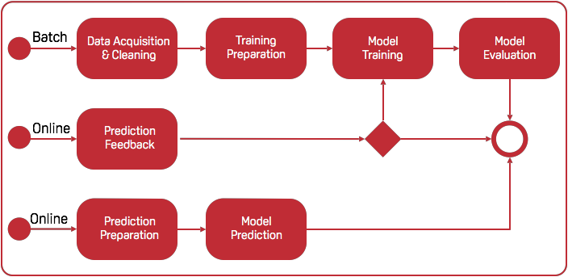

============================
Main Components
============================

Here we will explain the design pattern for MARVIN AI

DASFE
--------------

The DASFE design pattern stands for Data Acquisition, Selection, Feedback and Evaluation. In Marvin, the DASFE pattern is represented by the image below. Each box, which we call an Action, holds code written by the user.

MacOS Install
--------------

Toolbox will need some OS dependencies::

    $ sudo easy_install pip
    $ brew install openssl graphviz

We strongly recommend the use of VirtualEnv and VirtualEnvWrapper::

    $ sudo pip install --upgrade pip
    $ sudo pip install virtualenvwrapper --ignore-installed six

Spark installation (Optional)::

    $ curl https://d3kbcqa49mib13.cloudfront.net/spark-2.1.1-bin-hadoop2.6.tgz -o /tmp/spark-2.1.1-bin-hadoop2.6.tgz
    $ sudo tar -xf /tmp/spark-2.1.1-bin-hadoop2.6.tgz -C /opt/
    $ sudo ln -s /opt/spark-2.1.1-bin-hadoop2.6 /opt/spark
    $ echo "export SPARK_HOME=/opt/spark" >> $HOME/.bash_profile

If you do not have /opt directory created, before unpacking spark, run::

    $ sudo mkdir /opt

Marvin uses dafault values for these environment variables, but you can customize them (Optional)::

    $ echo "export WORKON_HOME=$HOME/.virtualenvs" >> $HOME/.bash_profile
    $ echo "export MARVIN_HOME=$HOME/marvin" >> $HOME/.bash_profile
    $ echo "export MARVIN_DATA_PATH=$HOME/marvin/data" >> $HOME/.bash_profile
    $ echo "source virtualenvwrapper.sh" >> $HOME/.bash_profile
    $ source ~/.bash_profile

Install python-toolbox::

    $ mkvirtualenv python-toolbox-env
    $ setvirtualenvproject
    $ pip install marvin-python-toolbox

Test the installation::

    $ marvin
